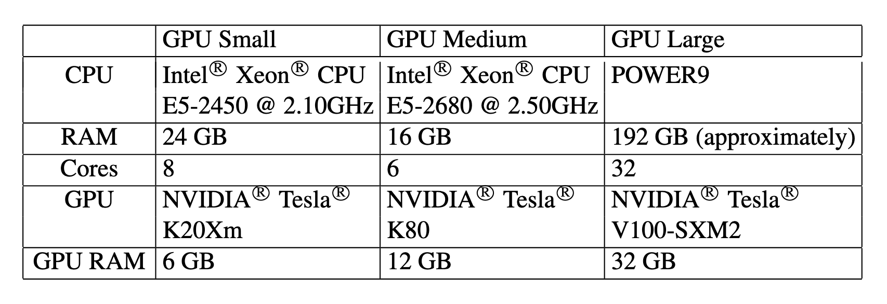
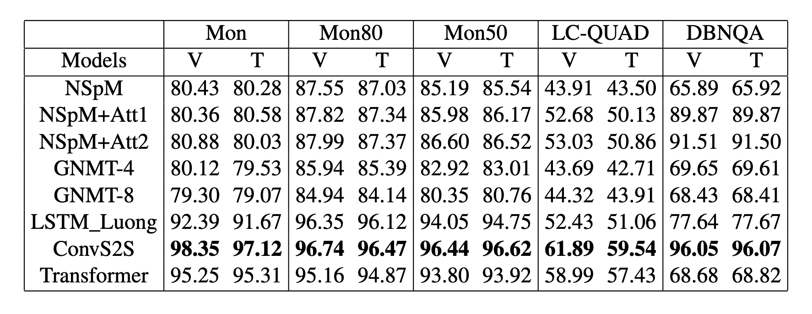
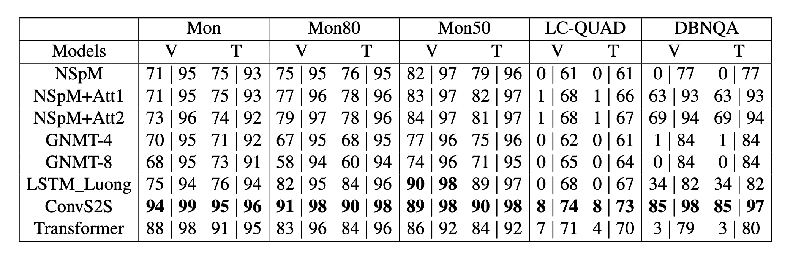

# TNTSPA (Translating Natural language To SPARQL)

SPARQL is a highly powerful query language for an ever-growing number of Linked Data resources and Knowledge Graphs. Using it requires a certain familiarity with the entities in the domain to be queried as well as expertise in the language's syntax and semantics, none of which average human web users can be assumed to possess. To overcome this limitation, automatically translating natural language questions to SPARQL queries has been a vibrant field of research. However, to this date, the vast success of deep learning methods has not yet been fully propagated to this research problem. 

This paper contributes to filling this gap by evaluating the utilization of eight different Neural Machine Translation (NMT) models for the task of translating from natural language to the structured query language SPARQL. While highlighting the importance of high-quantity and high-quality datasets, the results show a dominance of a CNN-based architecture with a BLEU score of up to 98 and accuracy of up to 94%. 


## Research Paper

*Title: Neural Machine Translating from Natural Language to SPARQL*

*Authors: [Dr. Dagmar Gromann](http://dagmargromann.com/), [Prof. Sebastian Rudolph](http://sebastian-rudolph.de/doku.php?id=home) and [Xiaoyu Yin](https://www.linkedin.com/in/xiaoyu-yin-387966125/)*

> PDF is [available](https://arxiv.org/pdf/1906.09302.pdf)

```
@article{DBLP:journals/corr/abs-1906-09302,
  author    = {Xiaoyu Yin and
               Dagmar Gromann and
               Sebastian Rudolph},
  title     = {Neural Machine Translating from Natural Language to {SPARQL}},
  journal   = {CoRR},
  volume    = {abs/1906.09302},
  year      = {2019},
  url       = {http://arxiv.org/abs/1906.09302},
  archivePrefix = {arXiv},
  eprint    = {1906.09302},
  timestamp = {Thu, 27 Jun 2019 18:54:51 +0200},
  biburl    = {https://dblp.org/rec/journals/corr/abs-1906-09302.bib},
  bibsource = {dblp computer science bibliography, https://dblp.org}
}
```


## Master thesis

*Title: Translating Natural language To SPARQL*

*Author: Xiaoyu Yin*

*Supervisor: [Dr. Dagmar Gromann](http://dagmargromann.com/), [Dr. Dmitrij Schlesinger](https://cvl.inf.tu-dresden.de/people/dmitrij-schlesinger/)*

**The thesis is already finished. (8th January 2019)** and has been turned into a paper (link above).

> Find the thesis in [thesis folder](thesis), and defense slides in [presentation folder](presentation), both available in `.tex` and `.pdf` version. 


## Datasets

### Downloads ([Google drive]((https://drive.google.com/open?id=1MOkIYnElmdxr5lEFB6nzH0fQzXZ_fPrp)))
- [Monument](https://drive.google.com/drive/folders/1gXgNlJPwdWBdM72Rogjhj9tCMnDD2jQ0?usp=sharing)
- [Monument80](https://drive.google.com/drive/folders/1WyE8l8btiwQz59-F_jFXRQMcwT0THYvB?usp=sharing)
- [Monument50](https://drive.google.com/drive/folders/1umvtkD0NkOe2Ly9OHe38FhBFMYBXtY8V?usp=sharing)
- [LC-QUAD](https://drive.google.com/drive/folders/1hqaPXRX5Ip5bbbIuSng5-YBEvahFPw3q?usp=sharing)
- [DBNQA](https://drive.google.com/drive/folders/18h8Reed4aO4Mkogp40uRyXeEXYmRV8Nx?usp=sharing)

### Usages

I downloaded them and have split them into the way I needed to train the models. The files ended with `*.en` (e.g. `dev.en`, `train.en`, `test.en`) contain English sentences, `*.sparql` files contain SPARQL queries. The ones with the same prefix name have 1-1 mapping that was used in the training as a English-SPARQL pair. `vocab.*` or `dict.` are vocabulary files. [fairseq](https://github.com/facebookresearch/fairseq) has its own special requirement of input files, therefore aforementioned files were not used directly by it but processed into binary formats stored in `/fairseq-data-bin` folder of each dataset.

### Sources

The datasets used in this paper were originally downloaded from Internet. The sources are listed as follows:
- [Neural SPARQL Machines Monument dataset](https://github.com/AKSW/NSpM/blob/master/data/monument_600.zip)
- [LC-QUAD](http://lc-quad.sda.tech/lcquad1.0.html) ([v2.0](http://lc-quad.sda.tech/index.html) is released! but we used 1.0)
- [DBpedia Neural Question Answering (DBNQA) dataset](https://figshare.com/articles/Question-NSpM_SPARQL_dataset_EN_/6118505)


## Exerimental setup

### Dataset splits and hyperparameters
see in paper

### Hardware configuration


## Results


### Raw data

We kept the inference translations of each model and dataset which was used to generate BLEU scores, accuracy, and corresponding graphs in below sections. The results are saved in the format of `dev_output.txt` (validation set) & `test_output.txt` (test set) version and available [here (compat version)](results).
> [Full version](results_raw) containing raw output of frameworks is also available

### Training graphs

Plots of training perplexity for each models and datasets are available in a separate PDF [here](visualizations/graphs_perplexity_alldataset.pdf).

### Test result graphs

Table of BLEU scores for all models and validation and test sets


Table of Accuracy (in %) of syntactically correct generated SPARQL queries | F1 score



## Trained models

Because some models were so space-consuming (esp. GNMT4, GNMT8) after training for some sepecific datasets (esp. DBNQA), I didn't download all the models from the HPC server. This is an overview of the availablity of the trained models on [my drive](https://drive.google.com/drive/folders/1l80E6CGCwzMK2y0f8B1wJZye29aZcGij?usp=sharing):

. | Monument | Monument80 | Monument50 | LC-QUAD | DBNQA
-- | -- | -- | -- | -- | --
NSpM | [yes](https://drive.google.com/open?id=1DMAvcX7tS3Z0KUgP6vOgsmfQvPxRa6pW) | [yes](https://drive.google.com/open?id=1inFYg671UXW9Q1deAt0IchGFAOlxkIOI) | [yes](https://drive.google.com/open?id=14kbo6l9HTX5Kr0u-OHEXgb90-68spnwX) | [yes](https://drive.google.com/open?id=1dUzA8YOZ_wpkW-wz4W4VeKcG3LD_uWER) | [yes](https://drive.google.com/open?id=1A0Biq1yQOpmm8tWrzIVisPYY6qHPN13t)
NSpM+Att1 | [yes](https://drive.google.com/open?id=1UiS1ZAPi8MoQOV5GS4LRa9tC_-cslq_C) | [yes](https://drive.google.com/open?id=1Flv5uWU7nz0baQVQZ2cL2uLHsEzD0jd-) | [yes](https://drive.google.com/open?id=1j7KA3wRSQtBcPQVQftSEf3yJ_kxizhti) | [yes](https://drive.google.com/open?id=1kfVWyZvyr9cdWglBYuCyx6k5b3edK6F2) | [yes](https://drive.google.com/open?id=1Xy7Ir-PUf4EiY9djOO69jv9_BwZLTnC5)
NSpM+Att2 | [yes](https://drive.google.com/open?id=1X0NVtXK3Yb1924NpFOg605u8wGwttsX6) | [yes](https://drive.google.com/open?id=1eGB6XAKAR9SvRCS-qTfFEJ5I6hjDoE72) | [yes](https://drive.google.com/open?id=1U7Pd9MFDtmq0qsxX7EFsx0KVy9_C6LIl) | [yes](https://drive.google.com/open?id=1Sd6Hj3Pgk0loj71IeYSbfJ0iCOiB0p1O) | [yes](https://drive.google.com/open?id=10Fh3GNZfGG9c1xupd_hkJOchcMCOI2FY)
GNMT4 | no | [yes](https://drive.google.com/open?id=1jZQVAO_quER4NQ1SPvK8-0TUS7F5Mo47) | no | no | no
GNMT8 | no | no | no | no | no
LSTM_Luong | [yes](https://drive.google.com/open?id=1GSx15sWeiychLnrhzL4U0L7LURwMJQxs) | [yes](https://drive.google.com/open?id=1YgWNPgiTcQTO9x419tXZ2_YO7xr1AzaI) | [yes](https://drive.google.com/open?id=1EUfEch7iQTvviAJGAjmnHoq8jCLvevTZ) | [yes](https://drive.google.com/open?id=1OiI7fO1wZywynMMvS5VstfLLDjwL_ToC) | no
ConvS2S | [yes](https://drive.google.com/open?id=1EGl_b9YtJ56K2ASsyXeAyjz5WhIqO77g) | [yes](https://drive.google.com/open?id=1OYcCr2OMGVpQ_lfWFdhcLPt88kBA5Lrm) | [yes](https://drive.google.com/open?id=1LxPX2RFIrXWF5BlHFHqZ6gf7cWM9FCAg) | [yes](https://drive.google.com/open?id=16pX_xn46nlT6jTIj5mBfx9wh4nFfFVka) | no
Transformer | [yes](https://drive.google.com/open?id=12ebpHPxIgoJb_5ug60TKEDnF47qlpdt7) | [yes](https://drive.google.com/open?id=1NhFbT5Ctt5v7_sD7iD_J_lpnOhM2bv25) | [yes](https://drive.google.com/open?id=1Zj4v-ItbFvUvHbnFxiRhPHppz6ZCOBD2) | [yes](https://drive.google.com/open?id=1PDzIQ8_kh_Gw5Ovwxvfe_fZM_RKV30Sd) | no


## One more thing

This paper and thesis couldn't have been completed without the help of my supervisors ([Dr. Dagmar Gromann](http://dagmargromann.com/), [Dr. Dmitrij Schlesinger](https://cvl.inf.tu-dresden.de/people/dmitrij-schlesinger/) and [Prof. Sebastian Rudolph](http://sebastian-rudolph.de/doku.php?id=home)) and those great open source projects. I send my sincere appreciation to  all of the people who have been working on this subject, and hopefully we will show the world its value in the near future.

- [Neural SPARQL Machines](https://github.com/AKSW/NSpM)
- [LC-QUAD](http://lc-quad.sda.tech/index.html)
- [DBNQA](https://github.com/AKSW/DBNQA)
- [fairseq](https://github.com/facebookresearch/fairseq)
- [nmt](https://github.com/tensorflow/nmt)

By the way, I work as an Android developer now, although I still have passion with AI and may want to learn more and probably even find a career in it in the future, currently my focus is on Software Engineering. I enjoy any kind of experience or knowledge sharing and would like to have new friends! Connect with me on [LinkedIn](https://www.linkedin.com/in/xiaoyu-yin-387966125/). 